+++
title = "Don't attach tooltips to document.body"
date = "2021-03-10"
+++

# Don't attach tooltips to document.body

## TL;DR
Instead of attaching tooltips directly to `document.body`, attach them to a predefined div in `document.body`.

**BAD**
```html
<body>
    <!-- temporary div, vanishes when tooltips vanishes -->
    <div>my tooltip</div>
<body>
```

**GOOD**
```html
<body>
    <!-- this div stays forever, just for attaching tooltips -->
    <div id="tooltips-container">
        <!-- temporary div, vanishes when tooltips vanishes -->
        <div>my tooltip</div>
    </div>
<body>
```

## Introduction
Tooltips in our app were taking `>80ms`. And during this time, the main thread was blocked, you couldn't interact with anything.

Other components like modal, popover, dropdown had similar performance issues. In some cases, a modal took more than 1 second to appear while making the UI unresponsive.

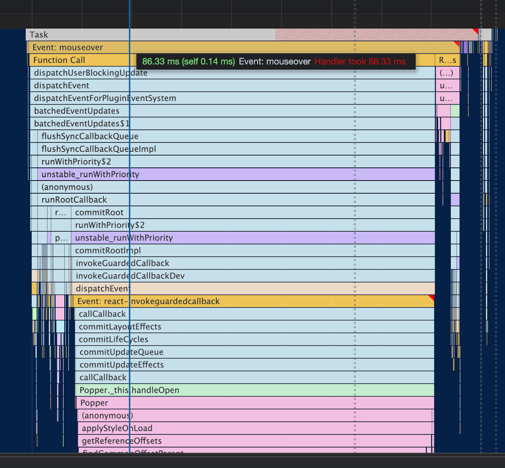

The main reason for the slowness of Tooltip was `Recalculate Style` being called at the end of mouseover event call stack which takes a lot of time.

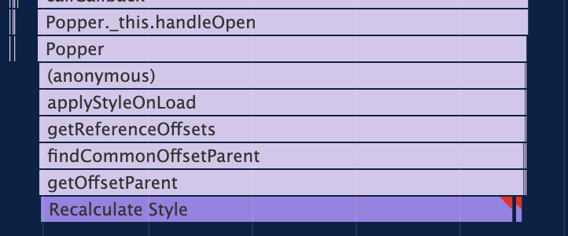

I noticed the tooltip performance was inversely proportional to number of DOM nodes currently in document.


This investigation started off with trying to use the css property `contain` to signal the browser about the containment of a particular DOM Node so that the `Recalculate Style` will not affect all the nodes. But applying the property on the element where we hover didn’t help as the tooltips were being rendered outside of the element, directly as a child of the `body` of the page.

Next step was to try rendering the tooltip into a separate container and not directly in the body. Then we’ll set the `contain` css property to signal the browser to not do the expensive `Recalculate Style`.

To my amazement, just having a separate container without even adding the css `contain` property fixed the performance. The main problem now, was to explain it. First I thought this might be some internal browser heuristic optimizing the `Recalculate Style`, but there is no black magic and I discovered the reason.

Before diving deep into the investigation, we'll talk about some prerequisites.

## How browser works at page load

The browser creates a DOM tree from the HTML string.

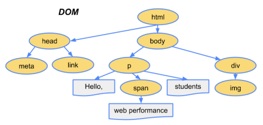

You can see it as `Parse HTML` in the performance timeline in Chrome DevTools.

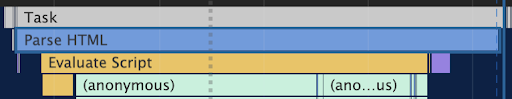

Then the CSS is parsed and browser creates the CSSOM (CSS Object Model).

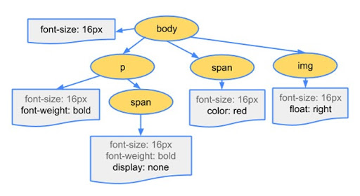

Then the browser combines the DOM and CSSOM to create the `render tree`.

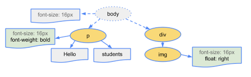

Render tree consists of elements currently visible on the page. Elements with property like `display: none` are not part of the `render tree`. If we have a pseudo element in CSS like `after`, then it is part of the `render tree` although it is not a part of the DOM.
The creation/modification of the render tree is called `Recalculate Style` in the performance timeline.


> Important: render tree is invalidated when we modify DOM or change styles of any element.

Next step is `layout`.
Layout is calculating the size and positions of elements of the render tree, to know where we have to draw exactly. This is referred to as `Layout` in the performance timeline.


`Layout` may need to be done again whenever there is a change in size/position of an element which affects the position of all the elements in the page.
`Layout` is also known as `Reflow`.

Next steps are `paint` and ~~composting~~ `composite` but we won’t talk about them here as they are not important for explanation of this topic.

## How browser handles rendering during runtime


To render a frame in a browser, we go in this order:
JavaScript runs, then there are style calculation, then layout.
Ignore Paint and Composite for now.

When we access any layout property like `offsetWidth`, `offsetParent`, `width` etc, the browser returns the value from previously calculated layout calculations, which is not expensive as the calculation was done earlier in the previous frame and now we are just reading it.

But what happens when we change a style on an element or modify the DOM? Then the browser has its own heuristics and is smart enough to know if the browser needs to `Recalculate Style`/`Layout` in the current frame or defer it for later.

You can see it as `Schedule Style Recalculation` in timeline.


The problem happens when we try to access a layout property just after we change style/modify DOM. Then the browser has to force `Recalculate Style`/`Layout` because browser has to return the current value, it cannot give you a stale value from the previous frame. This causes the problem known as `Layout Thrashing`. 

Example:  
**BAD**  

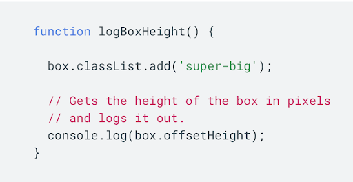

Here we are first changing the style and then immediately reading `offsetHeight` property which causes a `Synchronous Forced Layout`.

You’ll see this warning in browser when this happens:


**GOOD**  

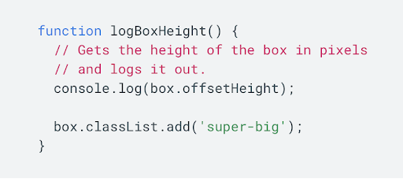

This is fine because we are first reading the layout property `offsetHeight` which is not expensive as we are just reading the value from the previous frame’s layout calculation. Then we change the style later which is ok, the layout might still happen but it is up to browser when to do it, it is not forced.

## Investigation
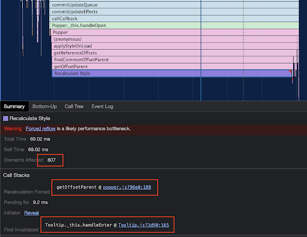

Here we can see a lot of elements (807) are affected by the `Recalculate Style` event which is the reason this event takes a lot of time.

The `Call Stacks` detail gives us important information to debug this issue.
The field `Recalculation Forced` shows the value `getOffsetParent @ popper.js:188` which is this code in `popper.js@1.15.0`:
```js
var offsetPArent = element.offsetParent;
```

The next field is `First Invalidation` with value `Tooltip._this.handleEnter @ Tooltip.js:165` in `@material-ui/core@3.9.3`
```js
_this.childrenRef.setAttribute('title', '');
```

The `First Invalidation` shows where in code, the render tree was first invalidated which later caused `Forced Reflow` because of `Recalculation Forced` code.

Doing `setAttribute` on an element in DOM is invalidating the render tree, and then accessing the `offsetParent` causes a `Forced Synchronous Layout`.

Had this been done in the opposite direction it wouldn't be a problem.

I tried commenting the setAttribute code and again ran the performance timeline. But the issue was still there but the invalidation was happening somewhere else.

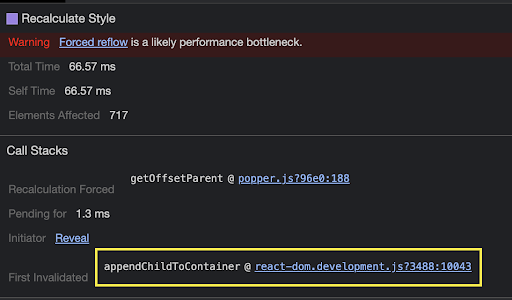

The invalidation is now happening when the tooltip is added to the body, which invalidates the render tree.

Popper accessing the `offsetParent` property after attaching the tooltip to the body is causing `Forced Reflow`. If this property access was done before attaching the tooltip to body, the reflow would not have happened.

But all this is not in our control as the code is in the third party library `popper.js`.

Now, what can we do?

Next, I created a separate container in the body where the tooltip would always be attached.

```html
<body>
    <div id="tooltips-container"></div>
    <div id="myapp">...</div>
</body>
```

And instructed the popper to be rendered in this container.

```js
const popperProps = {
    container: () => document.getElementById('tooltips-container'),
};
```

Now, the performance was greatly improved, the `Recalculate Style` still happened but its cost was less than before. 
0.79ms down from 66.57ms:

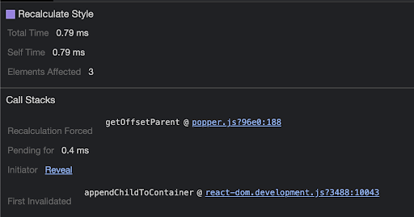

What happened here?
The tooltip was attached to the tooltip container and not to the body. This invalidated a much smaller subtree, which was the tooltip container. The tooltip container is not visible in the page, so modifying it doesn’t invalidate the complete page render tree. If the tooltip container would have been visible in the page, then the complete render tree would be invalidated but in this case only an independent subtree was invalidated. `Recalculating Style` for a small subtree of 3 doesn’t take a lot of time and hence is faster.  

The `Element Affected` is 3 which is the number of nodes inside our tooltip container.

```html
<div id="tooltips-container">
    <div role="tooltip" ...>
        <div class="MuiTooltip-tooltip-66 ..." ...>
            <span class="tooltipContent__..">
                Tooltip Text
            </span>
        </div>
    </div>
</div>
```

The ideal case would be to not access the `offsetParent` property in DOM after attaching it, but it is needed for `popper.js` to calculate where to render the tooltip.

Popper.js first attaches the tooltip to the body and then moves it to the correct position. If popper.js calculated the position first and then attached the tooltip to the body later, then we wouldn’t have this problem of `Recalculate Style`. We are using an older version of `@material-ui/core@3.9.3` which is using an old version of `popper.js@1.15.0`.

## Result
The mouseover event in our tooltip finishes much quickly and does not cause jank in the experience.  
**8ms from 80ms**  
Tooltips are now **10x faster**.

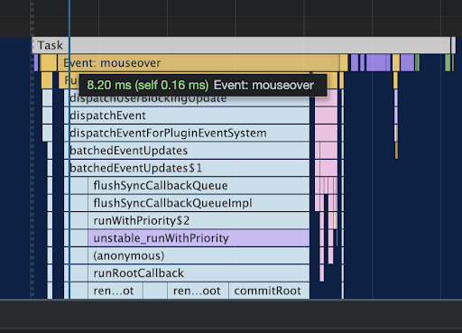

## References
- [Website Performance Optimization - Udacity](https://www.udacity.com/course/website-performance-optimization--ud884) (App load optimization)
- [Browser Rendering Optimization - Udacity](https://www.udacity.com/course/browser-rendering-optimization--ud860) (App runtime optimization)
- [Avoid forced synchronous layouts - Web Fundamentals Google](https://developers.google.com/web/fundamentals/performance/rendering/avoid-large-complex-layouts-and-layout-thrashing?utm_source=devtools#avoid_forced_synchronous_layouts)
- [What DOM element property access forces layout / reflow](https://gist.github.com/paulirish/5d52fb081b3570c81e3a)
- [CSS Containment in Chrome 52](https://developers.google.com/web/updates/2016/06/css-containment)
- [Improving Website Performance with CSS Containment by Manuel Rego | CSSconf EU 2019 Youtube](https://www.youtube.com/watch?v=iqcO-5_KkJ4)
- [Improving website performance with css containment - Slides](https://people.igalia.com/mrego/talks/cssconf-eu-2019-css-containment/)

## Discussions
- [Reddit](https://www.reddit.com/r/javascript/comments/p1xwz0/dont_attach_tooltips_to_documentbody/)
- [Hacker News](https://news.ycombinator.com/item?id=28230977)
